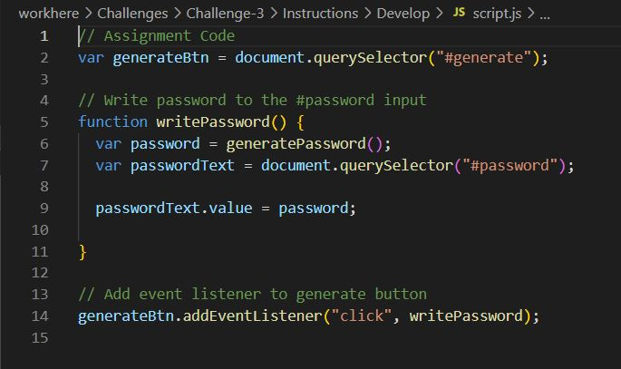
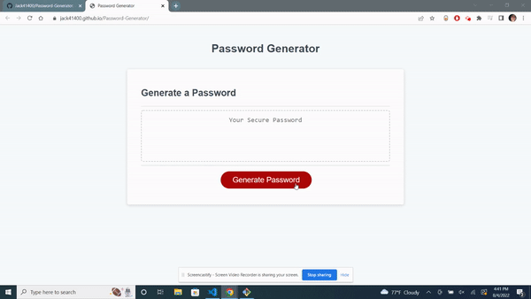
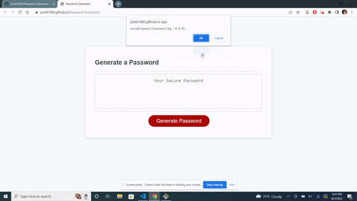
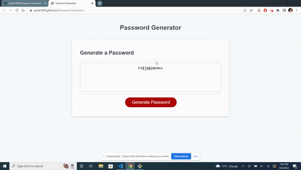

# Password Generator Project

## Description

This project was given as homework by MSU's coding bootcamp. The goal was to create a simple webpage that allowed users to set parameters that would generate a randomized password with JavaScript. Starter code was provied. The Starter webpage was stylized and set up but had no functionality.

The starter code included:
- A HTML webpage labeled 'index'
- A CSS style page
- The beginning Javascript that linked a text box and 'generate' button to the Javascript.

The randomizer and window prompt functions were left to be added in.

This project is currently deployed using Github Pages at [https://jack41400.github.io/Password-Generator/](https://jack41400.github.io/Password-Generator/)

## Table of contents

* [Description](#description)
* [Getting Started](#getting-started)
    - [Prerequisites](#prerequisites)
    - [Installing](#installing)
* [Main Goals](#main-goals)
* [Summary](#summary)
* [Usage](#usage)
* [What I learned](#what-i-learned)
* [Credits](#credits)

## Getting Started

### Prerequisites 

Besides a simple text editor to view the code. There are no specific requirements to view this project

### Installing

You can download the zip or clone a copy of this repository, or just follow the deployed Github Pages link [Here](https://jack41400.github.io/Password-Generator/)

## Main Goals

- Clicking the 'Generate' button causes a series of prompts for password criteria to appear
- Can select the appropriate criteria for the password being generated
- Can select any length for the password between 8 - 128 characters
- Can confirm lowercase, uppercase, numbers and special characters to be included in the password
- Input should be validated when at least one criteria is selected
- a password that matches the criteria selected should be generated
- The generated password should be displayed in an alert or written to the page.

## Summary

At first I was unsure of where to get started. I decided to start off with the actual password generation. I searched around online for some examples of for loops that used math.random to randomize character strings. Once I found a good example I set the length to 8 and the character set to a string of letters and numbers. Once the generate button in the HTML was linked to the JavaScript, the website would return a random string of 8 letters and numbers when the generate button was clicked. 

Once the password generator was set, I moved on to the next problem, which was working on the window prompts. I set a few varibles up for the window prompt and the multiple window confirm functions that needed to be written. I took inspirtation from an example I found online and made the character list variables objects and each character it's own array. This allowed me to use characters like ! and ( in the password generator with out messing with the code. I used the .join("") function to make the objects into arrays without including the commas seperating the characters.

I then started work on the window prompt function. I set the min and max varibles and added an option for if the user leaves the variable blank. After that I started work on the window confirm functions and a long string of if else statements to include all of the possible options. I am sure there is a better way, but this is the best way I could think of to implement it.

After all of the window prompts and confirms were written out. All I had to do was change the answers given into varibles that plugged into the for loop I implemented earlier. Once that was complete, The objectives for the project had been met!

## Usage

Once the webpage is opened, User can click the generate button.

Once the user clicks on the generate button, a window prompt will appear asking for password length. The user can input any integer from 8 - 128.

After the user inputs the the length they are then presents 4 confirm windows, confirm if they want to include Lowercase, Uppercase, Number, and or Special Characters in their password.

Once the user selects all of their criteria. They are then presented a generated password, fitting the criteria selected.

Full walkthrough below

## What I learned

## Credits

